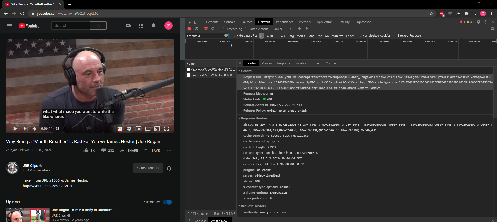
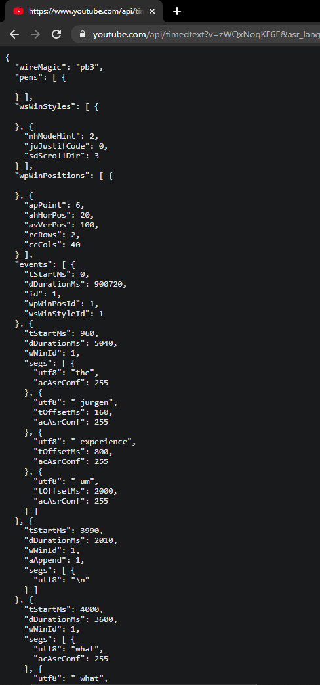
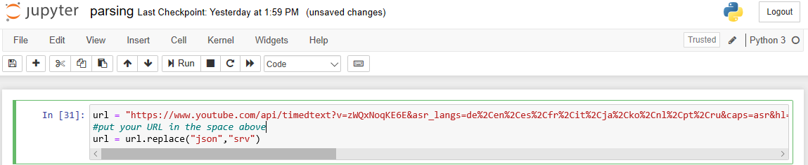
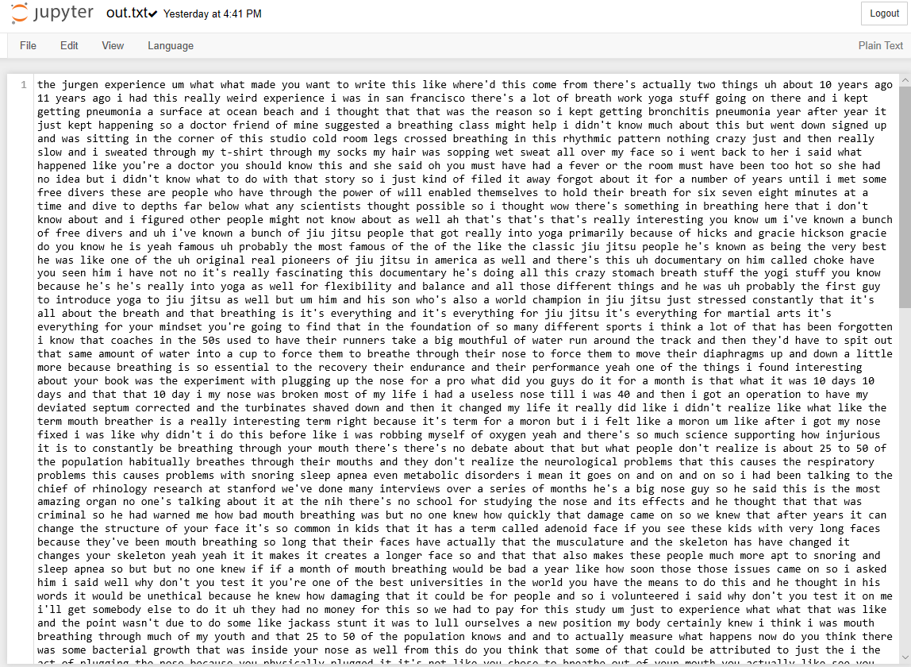
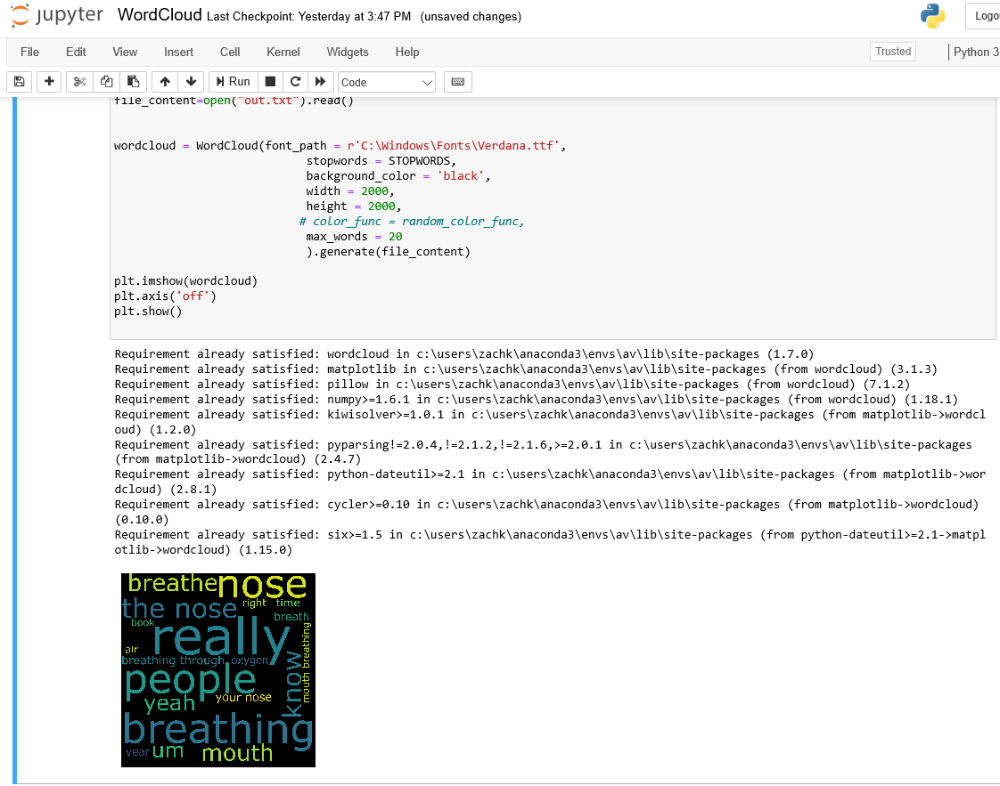

# YouTube-2-WordCloud
This program can take any YouTube video and tell you the top 20 words used in the video. It will also generate a text file containing the video's transcript if only the transcript is needed.

The first thing to do is choose your YouTube video and find the "timedtext" file generated by the YouTube's API.
This can be done by right-clicking the webpage while on your video, selecting "inspect", and then "network".
In network if you type "timedtext" in the filter, it will not show up
IMPORTANT: You must turn on Closed Captioning "CC" and then type in "timedtext" in order to find a link to the transcript.

Example below:

Now, copy the link highlighted by "Request URL"

You do not need to do this part, but so you understand what is happening, when you paste that link in the browser you get a JSON file that looks like this:

This is very ugly and difficult to work, so we will parse the file to generate a text document with just the words spoken in the video

Shown below:

Now that "out.txt" has been generated you can create the WordCloud. Run the WordCloud file and it will generate as shown below:

That's it!
